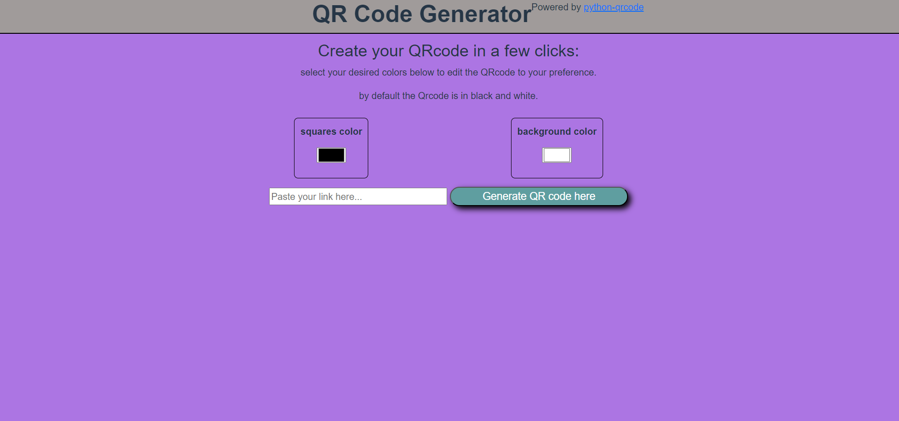
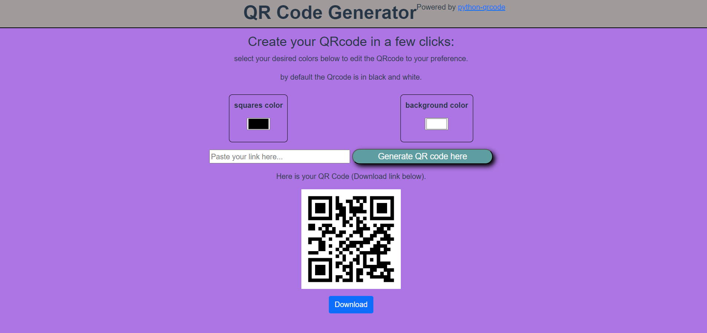

# QR code generator.


### the idea is to make a simple webpage for user to be able to generate new QR code.

### Learning about Flask framework in doing so.

# QR Code Generator

The purpose of this project is to create a simple web application where users can generate customized QR codes. The application is built using Python's Flask framework for the backend, and HTML/CSS for the frontend.

## Features
- Users can input a link or text and the app generates a QR code.
- Customizable colors for the filling and background colors.
- Download option on the user side, saved only temporarily in memory servers side.

## Requirements
Before running the app, ensure that the following dependencies are installed. They can be installed via the `requirements.txt` file.

```bash
pip install -r requirements.txt
```

before inserting a link

after inserting a link



